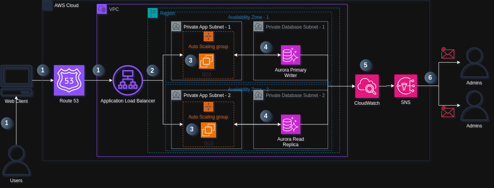

# Scalable Web Application with ALB and Auto Scaling

This project deploys a highly available and scalable web application using AWS EC2 instances, fronted by an Application Load Balancer (ALB) and dynamically scaled with an Auto Scaling Group (ASG). It ensures fault tolerance, cost optimization, and performance monitoring.

## Table of Content

- [Solution Overview](#solution-overview)
- [Architecture Diagram](#architecture-diagram)

# Solution Overview

This project deploys a highly available, fault-tolerant, and auto-scaled web application using AWS compute and networking services. The architecture leverages EC2 instances for hosting the application, an Application Load Balancer (ALB) to distribute traffic, and an Auto Scaling Group (ASG) to dynamically adjust capacity based on demand - ensuring optimal performance during traffic spikes while minimizing costs during low-traffic periods.

**The core architecture consists of:**

| **Layers**       | **Description**           | 
|-------------|------------------|
| **User Access Layer**       | **Users connect to the application via the ALB's DNS endpoint**        | 
| **Traffic Distribution Layer**         | **ALB routes requests across healthy EC2 instances in multiple Availability Zones** | 
| **Compute Layer**   | **Auto-scaled EC2 instances running the web application**   | 
| **Database Layer**      | **Amazon RDS with Multi-AZ deployment for database persistence**        | 
| **Management Layer**       | **CloudWatch monitoring and SNS alerts for operational visibility**  | 

**Key components include:**

| **Component**             | **Description**                                                                 |
|---------------------------|----------------------------------------------------------------------------------|
| **Amazon EC2**            | Virtual servers configured with a web server (Apache/Nginx) and application code |
| **Application Load Balancer (ALB)** | Distributes HTTP/HTTPS traffic and performs health checks                      |
| **Auto Scaling Group**    | Maintains desired capacity with scaling policies based on CPU/memory usage       |
| **Amazon RDS**            | Managed relational database with automated backups                               |
| **AWS IAM**               | Role-based permissions for secure resource access                                |
| **Amazon CloudWatch**     | Collects metrics and triggers scaling events                                     |
| **Amazon SNS**            | Notifies administrators of system events                                         |

# Architecture Diagram

Dynamic Image Transformation for Amazon CloudFront supports two architectures, one using an Amazon API Gateway REST API, and another using S3 Object Lambda. The Amazon API Gateway REST API architecture maintains the structure used in v6.3.3 and below of the Dynamic Image Transformation for Amazon CloudFront. The S3 Object Lambda architecture maintains very similar functionality, while also allowing for images larger than 6 MB to be returned. For more information, refer to the [Architecture Overview](https://docs.aws.amazon.com/solutions/latest/serverless-image-handler/architecture-overview.html) in the implementation guide.

The AWS CloudFormation template deploys an Amazon CloudFront distribution, Amazon API Gateway REST API/S3 Object Lambda, and an AWS Lambda function. Amazon CloudFront provides a caching layer to reduce the cost of image processing and the latency of subsequent image delivery. The Amazon API Gateway/S3 Object Lambda provides endpoint resources and triggers the AWS Lambda function. The AWS Lambda function retrieves the image from the customer's Amazon Simple Storage Service (Amazon S3) bucket and uses Sharp to return a modified version of the image. Additionally, the solution generates a CloudFront domain name that provides cached access to the image handler API. There is limited use of CloudFront functions for consistency and cache hit rate purposes.

## Default Architecture

## Detailed Workflow
*Step 1: User Requests*

Users access the application via the ALB’s DNS name (e.g., myapp-123456789.us-east-1.elb.amazonaws.com).
If using a custom domain (e.g., myapp.com), Route 53 routes traffic to the ALB.

*Step 2: Traffic Distribution (ALB)*

ALB checks health status of EC2 instances (HTTP 200 OK).
Routes requests to healthy instances across multiple AZs (e.g., us-east-1a, us-east-1b).

*Step 3: Auto Scaling (ASG)*

Scaling Policies (Example):
Scale Out: Add 2 instances if CPU > 70% for 5 minutes.
Scale In: Remove 1 instance if CPU < 30% for 15 minutes.

Launch Template: Defines EC2 configuration (AMI, instance type, security groups).

*Step 4: Database Layer*

EC2 instances connect to Amazon RDS (Multi-AZ enabled for failover).
Read Replicas added for read-heavy workloads.

*Step 5: Monitoring & Alerts*

CloudWatch Alarms trigger:

High CPU → Scale Out.

Low Requests → Scale In.

SNS Notifications alert admins via email/SMS for critical events.

!

