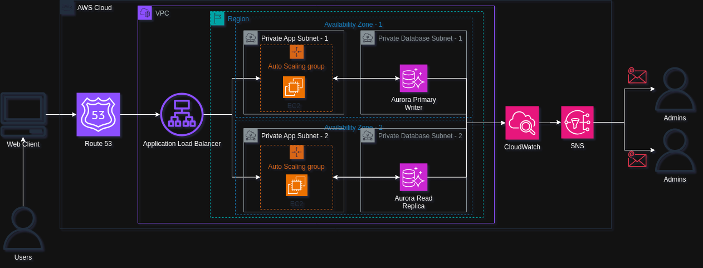

# Scalable Web Application with ALB and Auto Scaling

This project deploys a highly available and scalable web application using AWS EC2 instances, fronted by an Application Load Balancer (ALB) and dynamically scaled with an Auto Scaling Group (ASG). It ensures fault tolerance, cost optimization, and performance monitoring.

## Table of Content

- [Solution Overview](#solution-overview)
- [Architecture Diagram](#architecture-diagram)

# Solution Overview

This project deploys a highly available, fault-tolerant, and auto-scaled web application using AWS compute and networking services. The architecture leverages EC2 instances for hosting the application, an Application Load Balancer (ALB) to distribute traffic, and an Auto Scaling Group (ASG) to dynamically adjust capacity based on demand - ensuring optimal performance during traffic spikes while minimizing costs during low-traffic periods.

**The core architecture consists of:**

| **Layers**       | **Description**           | 
|-------------|------------------|
| **User Access Layer**       | **Users connect to the application via the ALB's DNS endpoint**        | 
| **Traffic Distribution Layer**         | **ALB routes requests across healthy EC2 instances in multiple Availability Zones** | 
| **Compute Layer**   | **Auto-scaled EC2 instances running the web application**   | 
| **Database Layer**      | **Amazon Aurora with Multi-AZ read replica for database persistence**        | 
| **Management Layer**       | **CloudWatch monitoring and SNS alerts for operational visibility**  | 

**Key components include:**

| **Component**             | **Description**                                                                 |
|---------------------------|----------------------------------------------------------------------------------|
| **Amazon EC2**            | Virtual servers configured with a web server (Apache/Nginx) and application code |
| **Application Load Balancer (ALB)** | Distributes HTTP/HTTPS traffic and performs health checks                      |
| **Auto Scaling Group**    | Maintains desired capacity with scaling policies based on CPU/memory usage       |
| **Amazon Aurora (MySQL-compatible)** | High-performance, MySQL-compatible managed database with built-in Multi-AZ replication, automated backups, auto-failover |
| **AWS IAM**               | Role-based permissions for secure resource access                                |
| **Amazon CloudWatch**     | Collects metrics and triggers scaling events                                     |
| **Amazon SNS**            | Notifies administrators of system events                                         |

# Architecture Diagram

The diagram below illustrates the end-to-end flow of the scalable web application, showcasing how user requests are processed across distributed AWS services.

## Default Architecture

## Detailed Workflow
*Step 1: User Requests*

Users access the application via the ALB’s DNS name (e.g., myapp-123456789.us-east-1.elb.amazonaws.com).
If using a custom domain (e.g., myapp.com), Route 53 routes traffic to the ALB.

*Step 2: Traffic Distribution (ALB)*

ALB checks health status of EC2 instances (HTTP 200 OK).
Routes requests to healthy instances across multiple AZs (e.g., us-east-1a, us-east-1b).

*Step 3: Auto Scaling (ASG)*

Scaling Policies (Example):
Scale Out: Add 2 instances if CPU > 70% for 5 minutes.
Scale In: Remove 1 instance if CPU < 30% for 15 minutes.

Launch Template: Defines EC2 configuration (AMI, instance type, security groups).

*Step 4: Database Layer*

EC2 instances connect to Amazon Aurora (MySQL-compatible) with Multi-AZ enabled for high availability and automatic failover. Read Replicas are added across Availability Zones for read-heavy workloads.

*Step 5: Monitoring*

CloudWatch Alarms trigger:

High CPU → Scale Out.

Low Requests → Scale In.

*Step 6: Alerting*

SNS Notifications alert admins via email/SMS for critical events.

# Cloudformation code 

AWS CloudFormation is a service that allows you to define and provision AWS infrastructure as code. Using templates written in YAML or JSON, you can automate the creation, update, and management of AWS resources in a safe and repeatable way. It helps simplify infrastructure deployment and ensures consistency across environments.

**CloudFormation Template**  
You can find the complete CloudFormation template for this architecture in the [`cloudformation.yaml`](./Cloudformation.yaml) file.

